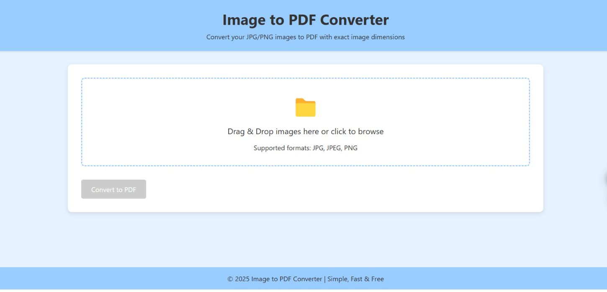

# 🖼️📄 Image to PDF Converter

A simple, fast, and user-friendly web app that allows users to upload JPG/PNG files and convert them into a PDF file.

## 🌟 Features
- 📤 Upload JPG or PNG images
- 📄 Convert images into a single PDF file
- ⚡ Fast and easy-to-use interface
- 🔄 Landscape and portrait mode available
- 📏 User can select PDF page size
- 📜 User can make the PDF page size the same as the image dimensions

## 🛠️ Technologies Used
- **HTML** - Structure of the web page
- **CSS** - Styling and responsiveness
- **JavaScript** - To add the functionality of the webpage

## ⚙️ Installation

1. Clone the repository:
```bash
git clone https://github.com/BikramMondal5/Image-to-pdf.git
```

2. Navigate to the project directory:
```bash
cd Image-to-pdf
```

3. Run the `index.html` file

4. Open the web browser to preview the application.

## 📸 Screenshot


## 🚀 How to Use

1. 📂 Select one or multiple JPG/PNG files.
2. 📏 Choose the desired page size and orientation (landscape/portrait).
3. 🔘 Click the **Convert to PDF** button.
4. 📥 Download the generated PDF file instantly.

## 🤝 Contribution

Feel free to fork this repository, raise issues, or submit pull requests to add features or improve the design.

## 📜 License

This project is licensed under the `MIT License`.
